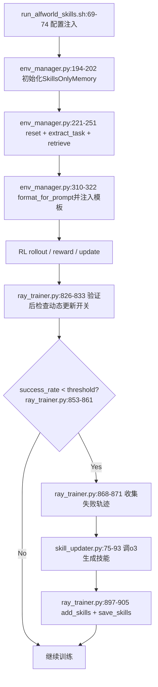

# SkillRL 训练流程（精确到文件与行号）

> 你提的点非常关键：下面每一步都给出“**哪个文件、哪一行**”在做这件事。

---

## 1) 训练开关是在哪里注入的？（脚本 -> Hydra）

以 ALFWorld 脚本为例：`examples/grpo_trainer/run_alfworld_skills.sh`

- 开启 skills-only memory：第 **69** 行 `+env.use_skills_only_memory=True`
- 技能库路径：第 **70** 行 `skills_json_path`
- 注入通用技能数量：第 **71** 行 `top_k=6`
- 开启动态更新：第 **72** 行 `enable_dynamic_update=True`
- 更新阈值：第 **73** 行 `update_threshold=0.4`
- 每轮最多新增技能：第 **74** 行 `max_new_skills=3`

这几行决定了后续环境和 trainer 的所有分支路径。

---

## 2) 环境侧是在哪些行完成“任务提取 + 技能检索 + prompt拼接”的？

核心文件：`agent_system/environments/env_manager.py`

### 2.1 初始化：选择 SkillsOnlyMemory

`AlfWorldEnvironmentManager.__init__`：

- 类定义与入口：**189-190** 行
- 判断是否启用 skills-only：**194** 行
- 构造 `SkillsOnlyMemory(...)`：**197-202** 行（传入 retrieval mode、embedding model、task_specific_top_k）

### 2.2 reset：每个任务先检索技能

`reset` 在 **221-251** 行，关键步骤：

1. 环境重置：**222** 行
2. 提取任务文本：`extract_task(text_obs)` 在 **228** 行
3. 若有 retrieval memory：进入 **231** 行分支
4. 对 batch 中每个任务调用 `retrieve(...)`：**240-247** 行
5. 检索结果保存：`self.retrieved_memories.append(memories)` 在 **248** 行
6. 产出初始文本观测：**250-251** 行

### 2.3 step/build_text_obs：把技能真正注入提示词

- `step` 函数：**253-271** 行
- `build_text_obs` 函数：**283-335** 行
- 启用检索模板分支判断：**298-301** 行
- 检索结果格式化：`format_for_prompt(...)` 在 **310-312** 行
- 把 `retrieved_memories` 填入 `ALFWORLD_TEMPLATE_WITH_MEMORY`：**313-322** 行

也就是说：**技能不是在 trainer 里拼 prompt，而是在 EnvManager 的 `build_text_obs` 里拼进去的**。

---

## 3) 检索算法骨架是在哪些行？（template / embedding）

核心文件：`agent_system/memory/skills_only_memory.py`

### 3.1 构造与模式选择

- `__init__`：**58-109** 行
- 模式合法性校验（template/embedding）：**78-81** 行
- 加载技能 JSON：**86-87** 行
- embedding 模式预计算缓存：**108-109** 行

### 3.2 template 模式

- 任务类型关键词检测：`_detect_task_type` 在 **115-177** 行
- template 分支入口：`retrieve` 中 **356** 行
- 通用技能截断：**357** 行
- 任务技能读取：**358** 行
- task_specific_top_k 截断逻辑：**360-363** 行

### 3.3 embedding 模式

- 加载 embedding 模型：`_get_embedding_model` 在 **183-196** 行
- 预计算技能 embedding：`_compute_skill_embeddings` 在 **208-251** 行
- 语义检索：`_embedding_retrieve` 在 **253-299** 行
  - query 编码：**278-283** 行
  - 余弦相似度（点积）：**285** 行
  - general/task 分块排序：**287-297** 行
- `retrieve` 的 embedding 分支：**335-351** 行

### 3.4 prompt 格式化

- `format_for_prompt`：**374-429** 行
- General Principles 段：**385-391** 行
- Task-specific Skills 段：**399-414** 行
- Mistakes to Avoid 段：**416-427** 行

---

## 4) 动态技能更新是在哪些行触发和执行的？

核心文件：`verl/trainer/ppo/ray_trainer.py`

### 4.1 验证后触发更新

- 在验证指标汇总后，判断开关并触发：**826-833** 行

### 4.2 更新主流程 `_update_skills_from_validation`

函数在 **837-912** 行，关键步骤：

1. 读阈值：**849-850** 行
2. 识别低成功率任务：**853-861** 行
3. 收集失败轨迹：**868-871** 行
4. lazy init `SkillUpdater`：**877-882** 行
5. 调 `analyze_failures(...)` 生成新技能：**890-895** 行
6. `add_skills` 加入 SkillBank：**897-900** 行
7. `save_skills` 落盘：**902-905** 行
8. 同步到训练环境：**907-910** 行

### 4.3 失败轨迹抽取

- `_collect_failed_trajectories`：**914-931** 行
- 目前以 `score <= 0` 判失败：**923** 行

---

## 5) SkillUpdater 在哪里把“失败 -> 新技能”落地？

核心文件：`agent_system/memory/skill_updater.py`

- 类入口：**17** 行
- Azure 凭据读取与校验：**24-32** 行
- 调用 o3：`analyze_failures` 内 **75-80** 行
- 解析返回 JSON：**81**, **192-204** 行
- 动态 skill_id 去冲突：
  - 扫描下一个 dyn index：**103-123** 行
  - 重写 dyn_XXX：**124-134** 行
- 构造失败分析 prompt：**136-182** 行

---

## 6) 例子（按真实代码路径逐步走）

任务：`Your task is to: clean some dirty apple and put it in/on the table.`

1. 启动脚本把 `use_skills_only_memory=True`、`top_k=6`、`enable_dynamic_update=True` 注入 Hydra（`run_alfworld_skills.sh` **69-74**）。
2. EnvManager 初始化时创建 `SkillsOnlyMemory`（`env_manager.py` **194-202**）。
3. `reset` 提取 task（**228**）并检索技能（**240-247**）。
4. `build_text_obs` 调 `format_for_prompt`（**310-312**），把技能注入 `ALFWORLD_TEMPLATE_WITH_MEMORY`（**313-322**）。
5. 训练/验证后，若某类任务成功率低于阈值，trainer 触发 `_update_skills_from_validation`（`ray_trainer.py` **826-833**, **837-912**）。
6. `SkillUpdater` 用失败样本生成新技能并写回（`skill_updater.py` **75-93**；`ray_trainer.py` **897-905**）。
7. 下轮检索会直接使用更新后的 skill bank（`add_skills` 在 `skills_only_memory.py` **458-489**）。

---

## 7) Mermaid：总流程图（含代码节点）

---

## 8) 你接下来怎么对照代码读（最快）

1. 先看脚本参数：`examples/grpo_trainer/run_alfworld_skills.sh` **69-74**。
2. 再看环境：`agent_system/environments/env_manager.py` **194-202**, **221-251**, **283-335**。
3. 再看检索器：`agent_system/memory/skills_only_memory.py` **58-109**, **115-177**, **253-299**, **305-372**。
4. 再看 trainer 动态更新：`verl/trainer/ppo/ray_trainer.py` **826-912**。
5. 最后看 LLM 生成技能细节：`agent_system/memory/skill_updater.py` **17-204**。
